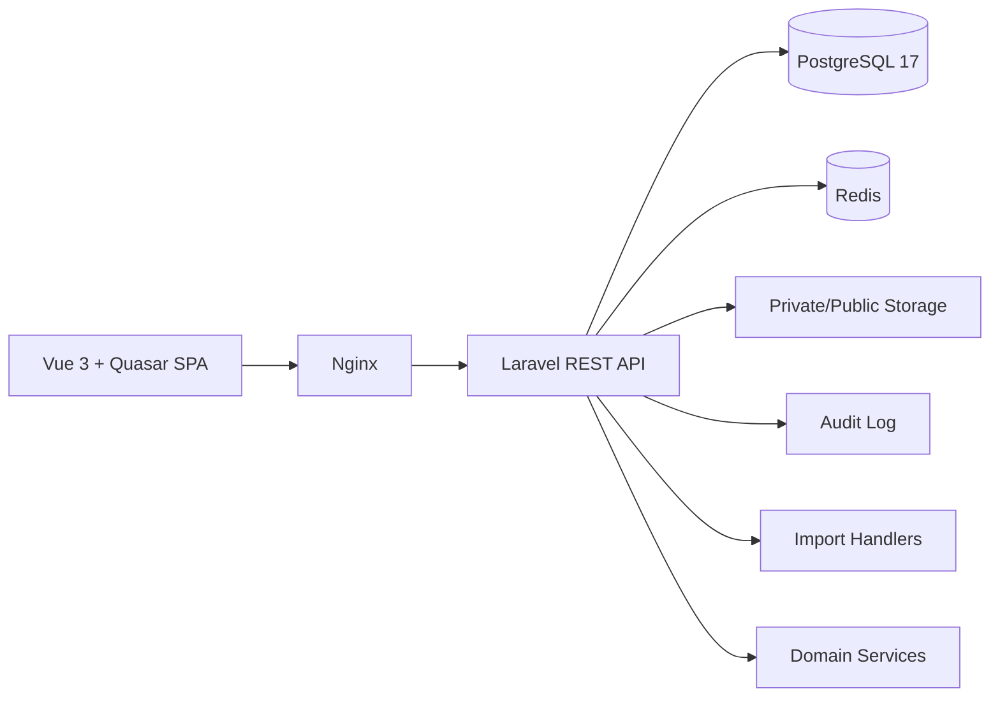

# CollegePortal

[Русский](README.md) | **English**

[](https://github.com/sKeepers/CollegePortal/actions/workflows/ci.yml)

CollegePortal is a modular information system for managing educational and administrative processes in a college.

Current status: **Private Release Candidate 0.8.0-rc2**. The repository is private and intended for controlled DEV/UAT work. The system is under User Acceptance Testing and is not ready for production use without a separate security and operations review.

## Purpose

CollegePortal provides one platform for admissions, student records, HR, academic planning, teaching load, scheduling, electronic journal, access control, attendance analytics, graduation, reporting preparation and controlled operations.

The platform is designed for Russian vocational and arts colleges, while the architecture keeps a path for broader college deployments and future English documentation.

## Main Modules

- Admissions, FIS GIA and Admissions import, applicant document registry and bulk operations.
- Unified Person foundation for applicants, students, teachers, employees, graduates, users and digital identities.
- Students, groups, teachers, subjects and classrooms.
- HR: employees, departments, positions, absences, availability and teacher replacements.
- Curriculum Engine, Teaching Load Engine, Schedule Engine and visual schedule editor.
- Schedule-linked electronic journal with attendance, grades, materials, completion and signatures.
- Exams, graduation, diploma data, FRDO and FIS package preparation.
- Digital QR passes, access gate, mobile scanner, attendance analytics and reports.
- Role-based dashboards, RBAC permission matrix, Audit Log, Settings and Reference Data.
- UAT Center, installer lifecycle, update, backup, restore and health checks.

## Business Process

```text
Applicant
-> application
-> document verification
-> enrollment
-> student
-> curriculum
-> teaching load
-> schedule
-> journal
-> exams
-> graduation
-> FRDO preparation
```

```text
Person
-> Employee
-> Teacher
-> HR statuses
-> availability
-> schedule replacements
```

## Architecture



Backend modules follow Laravel migrations, models, Form Requests, Resources, Services, Policies/Gates and middleware. Frontend modules use Vue 3, Vite, Pinia and Quasar. Docker Compose is used for DEV, UAT and release installation flows.

## Stack

- Backend: Laravel 12, PHP 8.4, PostgreSQL 17, Redis, REST API.
- Frontend: Vue 3, Vite, Pinia, Quasar.
- Infrastructure: Docker, Docker Compose, Nginx, Ubuntu Server 24.04 LTS.

## System Requirements

Recommended UAT server:

- Ubuntu Server 24.04 LTS amd64;
- 4 vCPU;
- 8 GB RAM minimum, 16 GB recommended;
- 60 GB disk minimum;
- Internet access for package and container image downloads during installation/build.

## Quick Install

```bash
tar -xzf college-portal-0.8.0-rc2.tar.gz
cd college-portal-0.8.0-rc2
sudo ./installer/install.sh
sudo /opt/college-portal/installer/check.sh
```

## Update, Backup And Restore

- Update: `sudo /opt/college-portal/installer/update.sh <release-archive.tar.gz>`
- Backup: `sudo /opt/college-portal/installer/backup.sh`
- Restore: `sudo /opt/college-portal/installer/restore.sh <backup-file>`
- Health check: `sudo /opt/college-portal/installer/check.sh`

Always create a backup before update or restore operations.

## Security

Do not commit or attach `.env`, passwords, tokens, private keys, certificates, real imports/exports, database dumps, backups, private storage, applicant documents, photos or screenshots with personal data. Use anonymized fixtures only.

See [SECURITY.md](SECURITY.md) and [SUPPORT.md](SUPPORT.md).

## Integrations

Current release prepares data and architecture for FIS GIA/Admissions and FRDO. Future integration directions include Moodle, LDAP/Active Directory, email, Telegram/MAX notifications and official external APIs.

## Roadmap

- 0.8: private Release Candidate, UAT readiness, installer validation and role-based testing.
- 0.9: pilot real data loading, UX hardening, reporting and operational documentation.
- 1.0: production readiness review, security hardening, backup drills, trusted TLS and support process.

Project board: [CollegePortal Roadmap](https://github.com/users/sKeepers/projects/2)

Release: [v0.8.0-rc2](https://github.com/sKeepers/CollegePortal/releases/tag/v0.8.0-rc2)

## Documentation

- [Architecture](docs/ARCHITECTURE_DOCUMENTATION.md)
- [Person Model](docs/PERSON_MODEL.md)
- [RBAC](docs/RBAC.md)
- [Audit Log](docs/AUDIT_LOG.md)
- [Data Import](docs/DATA_IMPORT.md)
- [Schedule Engine](docs/SCHEDULE_ENGINE.md)
- [Journal Engine](docs/JOURNAL_ENGINE.md)
- [HR Domain](docs/HR_DOMAIN.md)
- [Installation](docs/INSTALLATION.md)
- [Backup and Restore](docs/BACKUP_RESTORE.md)
- [UAT Plan](docs/UAT_PLAN.md)

## Reporting Issues

Use GitHub Issues in this private repository. Include version, role, page/API, steps to reproduce, expected result, actual result, severity and sanitized evidence. Never attach real personal data, dumps, backups, `.env`, tokens or private documents.
