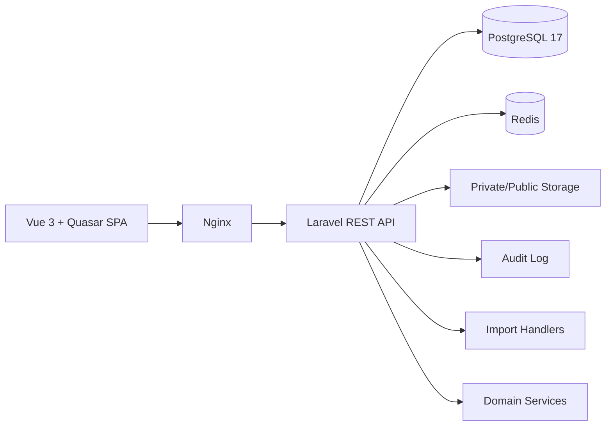

# CollegePortal

**Русский** | [English](README.en.md)

[](https://github.com/sKeepers/CollegePortal/actions/workflows/ci.yml)

CollegePortal — модульная информационная система для управления образовательными и административными процессами колледжа.

Текущий статус: **Private Release Candidate 0.8.0-rc2**. Репозиторий остается **PRIVATE** и используется для контролируемой разработки, DEV/UAT-проверок и подготовки пилотной эксплуатации. Система проходит UAT и не должна переноситься в production без отдельной проверки безопасности, резервного копирования и эксплуатационной готовности.

## Для кого предназначена система

CollegePortal создается для российских колледжей и организаций СПО, включая колледжи искусств, где нужно объединить приемную комиссию, контингент, учебный процесс, расписание, электронный журнал, пропускной режим, кадровый контур, отчеты и подготовку внешней отчетности в одной расширяемой платформе.

## Основные возможности

- Приемная комиссия: заявления, статусы, документы абитуриентов, массовые операции и зачисление.
- Импорт ФИС ГИА и Приема: загрузка XLS/XLSX, распознавание, dry-run, apply и журнал импорта.
- Person foundation: единая основа для абитуриентов, студентов, преподавателей, сотрудников, выпускников и пользователей.
- Контингент: студенты, группы, преподаватели, дисциплины, аудитории и справочники.
- Отдел кадров: сотрудники, подразделения, должности, HR-статусы, отсутствия и замены преподавателей.
- Учебные планы: Curriculum Engine, дисциплины по семестрам, часы, формы контроля и связь с группами.
- Нагрузка: формирование нагрузки из учебного плана, назначение преподавателей и контроль покрытия часов.
- Расписание: Schedule Engine, конфликты, шаблоны, визуальный редактор и действия из расписания.
- Электронный журнал: журнал занятия из расписания, посещаемость, оценки, материалы, завершение и подпись.
- Экзамены и ГИА: экзамены, результаты, связь с группами, дисциплинами, преподавателями и аудиториями.
- Выпуск: выпускники, дипломы, приложения, история и подготовка к ФРДО.
- ФРДО и ФИС: подготовка пакетов, проверка полноты, ошибки, экспорт CSV/JSON и статусы без реальной отправки.
- QR-пропуска: цифровые идентификаторы, QR, USB HID-сканер, мобильный сканер и отзыв пропусков.
- Проходная и посещаемость: события входа/выхода, отчеты, аналитика по расписанию и учет времени.
- Dashboard: ролевые и аналитические рабочие столы для руководства, учебной части и преподавателей.
- RBAC: роли, permissions, backend-проверки и permission-aware UI.
- Audit: централизованный журнал действий пользователей.
- UAT Center: подготовка пользовательского тестирования, сценарии, роли и обратная связь.
- Установщик: автономная установка, update, backup, restore, check и uninstall для Ubuntu Server.

## Роли пользователей

- Администратор системы.
- Директор и заместители директора.
- Учебная часть.
- Приемная комиссия.
- Преподаватель.
- Студент.
- Сотрудник проходной.
- Кадровая служба.

## Схема бизнес-процессов

```text
Абитуриент
-> заявление
-> проверка документов
-> зачисление
-> студент
-> учебный план
-> нагрузка
-> расписание
-> журнал
-> экзамены
-> выпуск
-> ФРДО
```

```text
Person
-> Employee
-> Teacher
-> HR-статусы
-> доступность
-> замены в расписании
```

## Архитектура



Backend построен на Laravel-модулях, миграциях, Eloquent-моделях, Form Request Validation, Resource-классах, Policy/Gate, middleware и сервисном слое. Frontend построен на Vue 3, Vite, Pinia и Quasar. DEV/UAT/release-сценарии используют Docker Compose и Nginx.

## Технологический стек

Backend:

- Laravel 12;
- PHP 8.4;
- PostgreSQL 17;
- Redis;
- REST API.

Frontend:

- Vue 3;
- Vite;
- Pinia;
- Quasar.

Инфраструктура:

- Docker / Docker Compose;
- Nginx;
- Ubuntu Server 24.04 LTS.

## Системные требования

Рекомендуемый UAT-сервер:

- Ubuntu Server 24.04 LTS amd64;
- 4 vCPU;
- минимум 8 GB RAM, рекомендуется 16 GB;
- минимум 60 GB диска;
- доступ в интернет для установки пакетов и загрузки Docker-образов.

## Рабочие каталоги разработки

Разрешенные рабочие каталоги проекта:

- Windows: `C:\!Projects\CollegePortal`;
- Windows worktrees: `C:\!Projects\CollegePortal\.worktrees\<branch>`;
- Linux DEV: `/srv/college-dev`.

Устаревшие Windows-копии проекта с нижним регистром в имени каталога, внешние каталоги worktree рядом с проектом и временные каталоги старой копии запрещены. CI выполняет проверку path policy через `scripts/repository/assert-path-policy.sh`.

## Быстрая установка

```bash
tar -xzf college-portal-0.8.0-rc2.tar.gz
cd college-portal-0.8.0-rc2
sudo ./installer/install.sh
sudo /opt/college-portal/installer/check.sh
```

Подробно: [docs/INSTALLATION.md](docs/INSTALLATION.md).

## Обновление

```bash
sudo /opt/college-portal/installer/update.sh college-portal-0.8.0-rc2.tar.gz
sudo /opt/college-portal/installer/check.sh
```

Перед обновлением обязательно сделать backup.

## Backup / Restore

```bash
sudo /opt/college-portal/installer/backup.sh
sudo /opt/college-portal/installer/restore.sh /srv/backups/college-portal/<backup-file>
```

Документация: [docs/BACKUP_RESTORE.md](docs/BACKUP_RESTORE.md).

## Безопасность

Не публикуйте и не прикладывайте в Issues/PR:

- `.env`, пароли, токены, приватные ключи и сертификаты;
- реальные XLS/XLSX/CSV импорты и экспорты;
- дампы БД, backups, runtime storage и release-архивы без отдельной проверки;
- документы абитуриентов, фотографии, паспортные данные, СНИЛС, адреса и телефоны;
- скриншоты с персональными данными.

Используйте обезличенные данные. Подробно: [SECURITY.md](SECURITY.md) и [SUPPORT.md](SUPPORT.md).

## Интеграции

В текущем RC реализована подготовка данных и контроль качества для ФИС ГИА/Приема и ФРДО без реальной отправки во внешние системы. Архитектура предусматривает будущие интеграции с Moodle, LDAP/Active Directory, email, Telegram/MAX и официальными внешними API.

## Дорожная карта

- 0.8: private RC, UAT, проверка установки, ролей, импорта данных и документации.
- 0.9: пилотная загрузка реальных данных, полировка UX, отчеты и эксплуатационные регламенты.
- 1.0: production readiness, security hardening, backup/restore drills, trusted TLS и поддержка.

GitHub Project: [CollegePortal Roadmap](https://github.com/users/sKeepers/projects/2)

Release: [v0.8.0-rc2](https://github.com/sKeepers/CollegePortal/releases/tag/v0.8.0-rc2)

## Документация

- [Архитектура](docs/ARCHITECTURE_DOCUMENTATION.md)
- [Доменная модель](docs/DOMAIN_MODEL.md)
- [Person Model](docs/PERSON_MODEL.md)
- [RBAC](docs/RBAC.md)
- [Audit Log](docs/AUDIT_LOG.md)
- [Импорт данных](docs/DATA_IMPORT.md)
- [Импорт ФИС](docs/FIS_ADMISSIONS_IMPORT.md)
- [Schedule Engine](docs/SCHEDULE_ENGINE.md)
- [Journal Engine](docs/JOURNAL_ENGINE.md)
- [HR Domain](docs/HR_DOMAIN.md)
- [Установка](docs/INSTALLATION.md)
- [Обновление](docs/UPDATE.md)
- [Backup / Restore](docs/BACKUP_RESTORE.md)
- [UAT Plan](docs/UAT_PLAN.md)
- [GitHub Repository](docs/GITHUB_REPOSITORY.md)

## Как сообщать об ошибках

Создавайте Issue в private-репозитории и указывайте:

- версию и build;
- роль пользователя;
- страницу или API;
- шаги воспроизведения;
- ожидаемый результат;
- фактический результат;
- критичность;
- environment;
- обезличенный скриншот или лог, если он нужен.

Не прикладывайте персональные данные, реальные базы, `.env`, токены, приватные документы и backups.

## CI

Статус CI отображается badge в начале README. Workflow проверяет backend tests, frontend build и secret scan.
