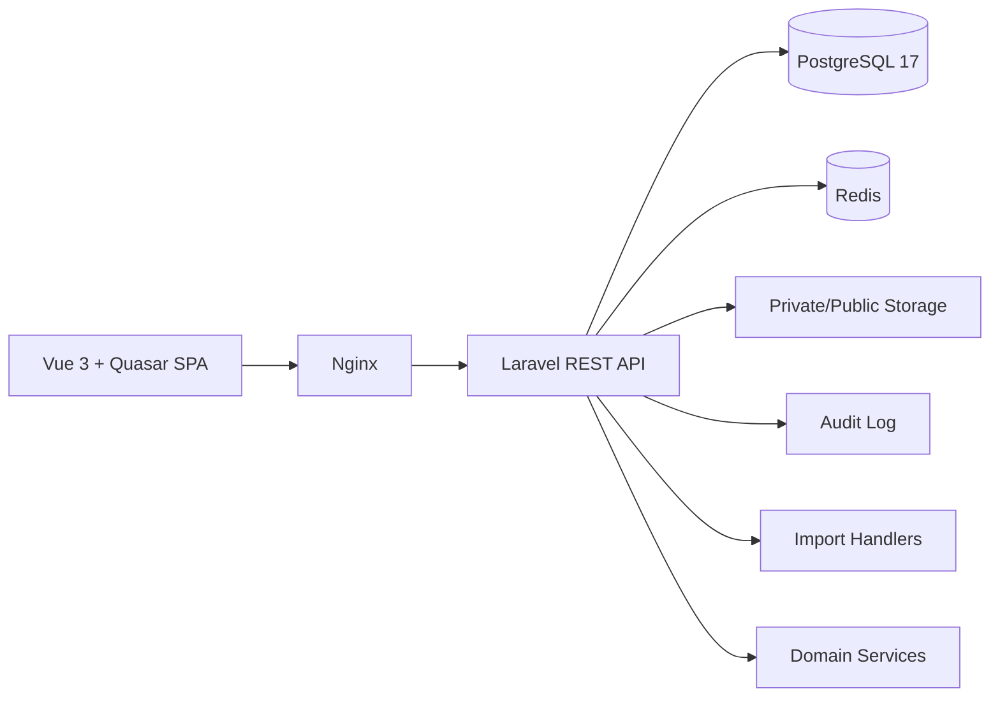

# CollegePortal

[](https://github.com/sKeepers/CollegePortal/actions/workflows/ci.yml)

CollegePortal is a modular information system for managing educational and administrative processes in a college.

Current status: **0.8.0-rc2 / Private Release Candidate**. The repository is private and intended for controlled DEV/UAT work. It is not ready for public distribution or production use without a separate security and operations review.

## Purpose

CollegePortal provides one platform for admissions, student records, academic planning, scheduling, journal work, access control, attendance analytics, HR, reporting and controlled preparation of external reporting data.

The project is designed for a Russian СПО / college context and is being developed incrementally as an MVP-first platform.

## Main Modules

- **Person**: unified person foundation for students, teachers, applicants, graduates, users and digital identities.
- **Admissions and FIS import**: admissions registry, FIS GIA and Admissions XLS import, applicant document registry and bulk operations.
- **Students, Groups, Teachers, Subjects, Classrooms**: core academic directories and CRUD modules.
- **HR**: employees, departments, positions, absence calendar and teacher replacement workflow.
- **Curricula**: Curriculum Engine foundation with normalized semester subjects and hours.
- **Teaching Load**: generation from curricula, assignment and coverage tracking.
- **Schedule Engine**: normalized schedule entries, conflict checks, weekly templates and visual editor.
- **Journal**: schedule-linked electronic journal, attendance, grades, lesson files, completion and signature workflow.
- **QR and Access Gate**: digital passes, USB HID scanner support, mobile camera scanner and access event reports.
- **Attendance**: analysis of access events against schedule, daily and historical reports.
- **Graduation, FRDO, FIS**: preparation, validation, export and status tracking without real external submission.
- **RBAC**: role and permission matrix with backend middleware and permission-aware UI.
- **Audit**: centralized audit log for security-relevant actions.
- **Settings and Reference Data**: administrative settings center and shared reference catalogs.
- **UAT Center**: role-based testing runs, feedback and private screenshots.
- **Installer Lifecycle**: install, update, backup, restore, check and uninstall scripts for Ubuntu Server.

## High-Level Architecture



The backend follows Laravel service/resource/request patterns. The frontend uses Vue 3, Vite, Pinia and Quasar components. Docker Compose is used for local and release deployments.

## Technology Stack

Backend:

- Laravel 12
- PHP 8.4
- PostgreSQL 17
- Redis
- REST API

Frontend:

- Vue 3
- Vite
- Pinia
- Quasar

Infrastructure:

- Docker / Docker Compose
- Nginx
- Ubuntu Server 24.04 LTS

## System Requirements

Recommended UAT server:

- Ubuntu Server 24.04 LTS amd64
- 4 vCPU
- 8 GB RAM minimum, 16 GB recommended
- 60 GB disk minimum
- Internet access for package and image downloads during install/build

## Quick Start With Installer

Build or use a release archive from DEV:

```bash
./scripts/release/build-release.sh
```

Install on a clean Ubuntu Server:

```bash
tar -xzf college-portal-0.8.0-rc2.tar.gz
cd college-portal-0.8.0-rc2
sudo ./installer/install.sh
```

Check installation:

```bash
sudo /opt/college-portal/installer/check.sh
```

Lifecycle documentation:

- `docs/INSTALLATION.md`
- `docs/UPDATE.md`
- `docs/BACKUP_RESTORE.md`
- `docs/UNINSTALL.md`
- `docs/INSTALLATION_ACCEPTANCE_TEST.md`
- `docs/UAT_SERVER.md`

## Development

DEV work happens in `/srv/college-dev` on the development server. PROD and UAT are not modified without a separate explicit task.

Typical checks:

```bash
docker compose exec -T backend php artisan test
docker compose exec -T frontend npm run build
```

## Personal Data Rules

Do not commit or upload:

- `.env` files, passwords, tokens, private keys or certificates;
- real imports/exports, XLS/XLSX/CSV with college data, dumps or backups;
- private storage, applicant documents, photos, screenshots with personal data;
- release archives or runtime files.

Use anonymized fixtures only. Mask passport data, SNILS, addresses, phones and full personal identifiers in previews, logs and documentation.

## Documentation Map

- Architecture: `docs/ARCHITECTURE_DOCUMENTATION.md`, `docs/DOMAIN_MODEL.md`
- Identity and Person: `docs/IDENTITY_DOMAIN.md`, `docs/PERSON_MODEL.md`
- RBAC: `docs/RBAC.md`
- Audit: `docs/AUDIT_LOG.md`
- Import: `docs/DATA_IMPORT.md`, `docs/FIS_ADMISSIONS_IMPORT.md`
- Schedule and Journal: `docs/SCHEDULE_ENGINE.md`, `docs/JOURNAL_ENGINE.md`
- HR: `docs/HR_DOMAIN.md`, `docs/HR_ABSENCE_CALENDAR.md`, `docs/HR_REPLACEMENTS.md`
- UAT: `docs/UAT_PLAN.md`, `docs/UAT_EXECUTION_GUIDE.md`, `docs/INSTALLATION_ACCEPTANCE_TEST.md`

## Roadmap To 1.0

- 0.8: controlled private UAT, installer validation, role-based testing and data import hardening.
- 0.9: pilot real data loading, UX hardening, reporting and operational documentation.
- 1.0: production readiness review, security hardening, backup/restore drills, trusted TLS and controlled deployment process.

## Status

This repository is private. Treat all code, documents and screenshots as internal project material until a separate publication decision is made.
