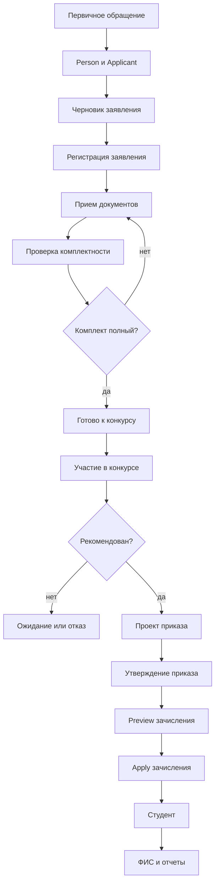
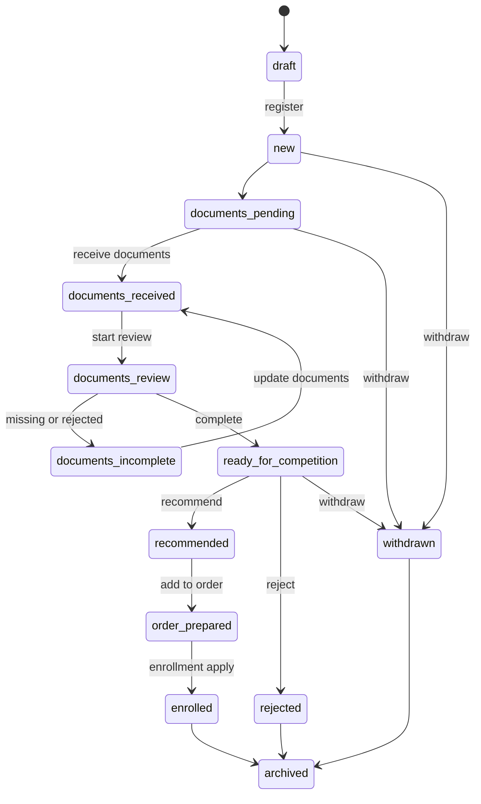
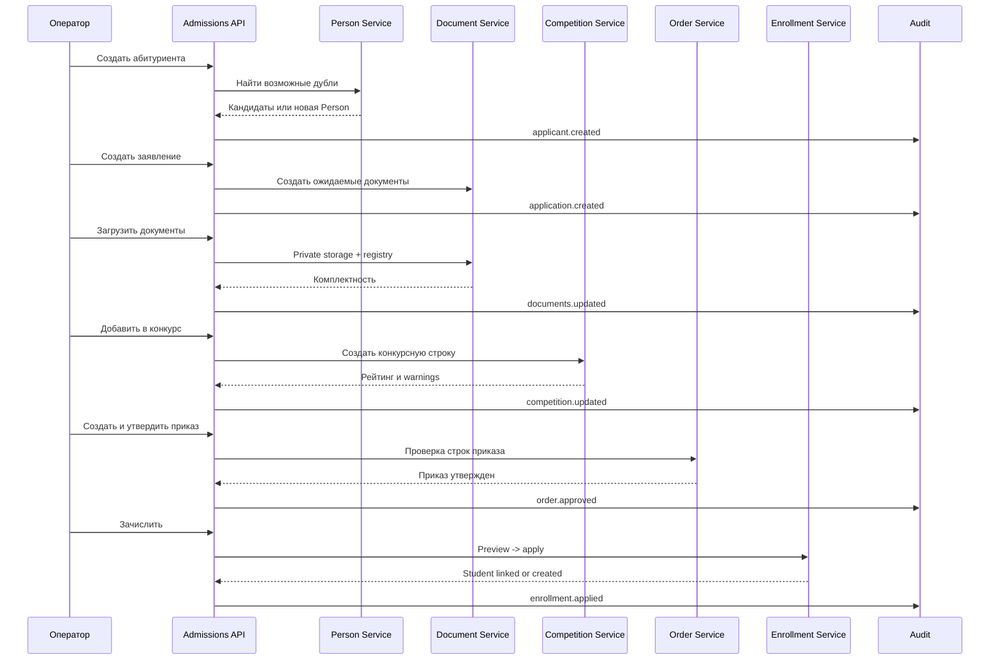

# API приемной комиссии

Документ проектирует REST API, пользовательские сценарии и бизнес-процессы подсистемы «Приемная комиссия» для ADM-003. Backend, frontend, миграции, Laravel-модели, Vue/Quasar и бизнес-логика в рамках ADM-003 не создаются.

Источники истины:

- [Приемная комиссия](ПРИЕМНАЯ_КОМИССИЯ.md);
- [Модель данных приемной комиссии](МОДЕЛЬ_ДАННЫХ_ПРИЕМНОЙ_КОМИССИИ.md);
- [ADR-002](adr/ADR-002_ПРИЕМНАЯ_КОМИССИЯ.md);
- [ADR-003](adr/ADR-003_МОДЕЛЬ_ДАННЫХ_ПРИЕМНОЙ_КОМИССИИ.md).

# Общая архитектура API

Базовый префикс:

```text
/api/admissions
```

API делится на bounded areas:

- applicants;
- applications;
- choices;
- documents;
- completeness;
- achievements;
- exams;
- competitions;
- orders;
- enrollments;
- FIS packages;
- reference data;
- events.

Принципы:

- backend является источником истины для статусов, прав и бизнес-ограничений;
- frontend может скрывать действия без permission, но не заменяет backend-проверки;
- критичные операции оформляются отдельными командными endpoints, а не скрытыми side effects обычного `PUT`;
- операции с юридическим или массовым эффектом выполняются через `preview -> apply`;
- документы скачиваются только через защищенный backend endpoint;
- ФИС является integration snapshot, а не частью CRUD заявления;
- все изменения пишутся в Audit без чувствительных payload.

Типовой успешный ответ:

```json
{
  "data": {},
  "meta": {
    "request_id": "uuid",
    "timestamp": "2026-07-24T12:00:00+03:00"
  }
}
```

Типовая ошибка:

```json
{
  "message": "Описание ошибки",
  "code": "admissions.validation_failed",
  "errors": {},
  "request_id": "uuid"
}
```

Типовые HTTP-коды:

| Код | Значение |
| --- | --- |
| `200` | запрос выполнен |
| `201` | сущность создана |
| `202` | операция принята |
| `400` | неверная операция |
| `401` | пользователь не вошел |
| `403` | недостаточно прав |
| `404` | сущность не найдена |
| `409` | конфликт состояния или дубль |
| `422` | ошибка валидации |
| `429` | превышен лимит |
| `500` | внутренняя ошибка |

# Роли пользователей

| Роль | Назначение | Общий доступ |
| --- | --- | --- |
| Администратор | системная настройка, права, справочники, аудит | полный доступ |
| Ответственный секретарь | кампания, конкурс, приказы, ФИС | управление приемной комиссией |
| Оператор | первичная регистрация и документы | операционные CRUD-действия |
| Директор | контроль и аналитика | read-only и отчеты |
| Учебная часть | сверка зачисления и групп | просмотр и preview зачисления |
| Абитуриент | будущий личный кабинет | только собственные данные |

Подробная матрица прав: [RBAC приемной комиссии](RBAC_ПРИЕМНОЙ_КОМИССИИ.md).

# Пользовательские сценарии

## Создание абитуриента

1. Сотрудник вводит ФИО и известные идентификаторы.
2. API ищет возможные дубли Person.
3. Если дублей нет, создается Person и Applicant.
4. Если дубли есть, API возвращает кандидатов без раскрытия чувствительных данных.
5. Сотрудник выбирает существующую Person или подтверждает создание новой.
6. Audit фиксирует создание профиля или ручную привязку.

## Создание заявления

1. Сотрудник выбирает абитуриента.
2. Указывает кампанию, базу поступления, форму обучения, финансирование и программы.
3. API создает заявление в `draft` или `new`.
4. API создает ожидаемый список документов по правилам кампании.
5. Audit фиксирует заявление и выбранные программы.

## Редактирование заявления

1. Сотрудник изменяет разрешенные текущим статусом поля.
2. API проверяет permission, статус, конкурсные блокировки и приказы.
3. Изменение сохраняется.
4. Если изменение влияет на документы или конкурс, API возвращает warnings.

## Прикрепление документов

1. Сотрудник выбирает тип документа.
2. Отмечает получение или загружает файл.
3. API сохраняет registry документа и файл в private storage.
4. Проверяющий подтверждает или отклоняет документ.
5. Комплектность пересчитывается отдельно от `documents_provided`.

## Проверка комплектности

1. API получает обязательные документы для кампании и программы.
2. Сравнивает требования с registry документов.
3. Возвращает `no_documents`, `incomplete` или `complete`.
4. Не меняет автоматически `ready_for_enrollment`.

## Регистрация заявления

1. Черновик проверяется на обязательные поля.
2. API проверяет уникальность номера и внешних идентификаторов.
3. Статус меняется на `new` или `documents_pending`.
4. Событие пишется в Audit и историю заявления.

## Участие в конкурсе

1. Заявление добавляется в конкурс.
2. API проверяет комплектность, программу, квоту и правила кампании.
3. Конкурсная строка получает расчетные баллы.
4. Рейтинг пересчитывается отдельной командой.
5. Рекомендация не является приказом.

## Выпуск приказа

1. Секретарь создает проект приказа.
2. В приказ добавляются конкурсные строки или заявления.
3. API проверяет рекомендации и отсутствие дублей.
4. Утверждение требует подтверждения.
5. Утвержденный приказ блокирует обычное редактирование строк.

## Зачисление

1. По утвержденному приказу запускается preview.
2. API показывает, кто может быть зачислен, где есть дубли и какие данные отсутствуют.
3. Apply создает или связывает Student с Person.
4. Повторный apply не создает дублей.
5. Результат фиксируется в Enrollment и Audit.

## Экспорт в ФИС

1. Пользователь выбирает кампанию, заявления или приказ.
2. API формирует preview ФИС-пакета.
3. Выполняется внутренняя validation.
4. Создается пакет-снимок без production-отправки.
5. Transport во внешний контур остается в integration layer.

# REST API

Для каждого endpoint поля таблицы означают:

- URL — целевой путь;
- Метод — HTTP method;
- Назначение — бизнес-смысл;
- Параметры — query/path/multipart параметры;
- Тело запроса — JSON или multipart payload;
- Ответ — основная форма результата;
- Ошибки — ожидаемые HTTP-коды;
- Права доступа — permission на backend.

## Абитуриенты

| URL | Метод | Назначение | Параметры | Тело запроса | Ответ | Ошибки | Права доступа |
| --- | --- | --- | --- | --- | --- | --- | --- |
| `/api/admissions/applicants` | `GET` | список абитуриентов | `q`, `status`, `source`, `campaign_id`, `responsible_user_id`, `page`, `per_page`, `sort` | нет | applicants, Person summary, active applications, pagination | `401`, `403`, `422` | `admissions.applicants.view` |
| `/api/admissions/applicants` | `POST` | создать Applicant и при необходимости Person | нет | `person`, `source_id`, `responsible_user_id`, `duplicate_resolution` | Applicant, Person, duplicate warnings | `401`, `403`, `409`, `422` | `admissions.applicants.create`, `people.link` |
| `/api/admissions/applicants/{applicantId}` | `GET` | карточка абитуриента | `include` | нет | Applicant, Person, applications, events | `401`, `403`, `404` | `admissions.applicants.view` |
| `/api/admissions/applicants/{applicantId}` | `PUT` | обновить профиль абитуриента | path `applicantId` | `source_id`, `responsible_user_id`, `status_id`, `notes` | обновленный Applicant | `401`, `403`, `404`, `409`, `422` | `admissions.applicants.update` |
| `/api/admissions/applicants/{applicantId}/archive` | `POST` | архивировать профиль | path `applicantId` | `reason` | архивированный Applicant | `401`, `403`, `404`, `409`, `422` | `admissions.applicants.archive` |

## Заявления

| URL | Метод | Назначение | Параметры | Тело запроса | Ответ | Ошибки | Права доступа |
| --- | --- | --- | --- | --- | --- | --- | --- |
| `/api/admissions/applications` | `GET` | список заявлений | `q`, `campaign_id`, `status`, `documents_status`, `program_id`, `specialty_id`, `education_form_id`, `funding_form_id`, `page`, `per_page`, `sort` | нет | applications, KPI текущей выборки, pagination | `401`, `403`, `422` | `admissions.applications.view` |
| `/api/admissions/applications` | `POST` | создать заявление | нет | `applicant_id`, `campaign_id`, `submitted_at`, `base_education_type_id`, `education_form_id`, `funding_form_id`, `choices`, `comment` | заявление, ожидаемые документы, warnings | `401`, `403`, `404`, `409`, `422` | `admissions.applications.create` |
| `/api/admissions/applications/{applicationId}` | `GET` | полная карточка заявления | `include` | нет | application, choices, documents, competition, orders, enrollment | `401`, `403`, `404` | `admissions.applications.view` |
| `/api/admissions/applications/{applicationId}` | `PUT` | изменить редактируемые поля | path `applicationId` | `submitted_at`, `status_id`, `base_education_type_id`, `education_form_id`, `funding_form_id`, `responsible_user_id`, `comment` | обновленное заявление, warnings | `401`, `403`, `404`, `409`, `422` | `admissions.applications.update` |
| `/api/admissions/applications/{applicationId}/register` | `POST` | зарегистрировать черновик | path `applicationId` | `registered_at`, `confirm_required_fields` | зарегистрированное заявление | `401`, `403`, `404`, `409`, `422` | `admissions.applications.register` |
| `/api/admissions/applications/{applicationId}/withdraw` | `POST` | отозвать заявление | path `applicationId` | `reason`, `document_id` | заявление `withdrawn` | `401`, `403`, `404`, `409`, `422` | `admissions.applications.withdraw` |

## Выбранные специальности

| URL | Метод | Назначение | Параметры | Тело запроса | Ответ | Ошибки | Права доступа |
| --- | --- | --- | --- | --- | --- | --- | --- |
| `/api/admissions/applications/{applicationId}/choices` | `GET` | список выбранных программ | path `applicationId` | нет | choices с приоритетами | `401`, `403`, `404` | `admissions.applications.view` |
| `/api/admissions/applications/{applicationId}/choices` | `POST` | добавить программу | path `applicationId` | `specialty_id`, `education_program_id`, `priority`, `education_form_id`, `funding_form_id`, `quota_type_id` | созданный choice | `401`, `403`, `404`, `409`, `422` | `admissions.choices.manage` |
| `/api/admissions/applications/{applicationId}/choices/{choiceId}` | `PUT` | изменить выбор | path ids | `priority`, `education_form_id`, `funding_form_id`, `quota_type_id`, `status_id` | обновленный choice | `401`, `403`, `404`, `409`, `422` | `admissions.choices.manage` |
| `/api/admissions/applications/{applicationId}/choices/{choiceId}` | `DELETE` | удалить или архивировать выбор | path ids | `reason` | пустой ответ или archived choice | `401`, `403`, `404`, `409`, `422` | `admissions.choices.manage` |

## Документы и комплектность

| URL | Метод | Назначение | Параметры | Тело запроса | Ответ | Ошибки | Права доступа |
| --- | --- | --- | --- | --- | --- | --- | --- |
| `/api/admissions/applications/{applicationId}/documents` | `GET` | документы заявления | `include=files,requirements` | нет | documents, files summary, requirements, missing list | `401`, `403`, `404` | `admissions.documents.view` |
| `/api/admissions/applications/{applicationId}/documents/{documentTypeId}/receive` | `POST` | отметить получение документа | path ids | `received_at`, `number`, `issued_at`, `expires_at`, `comment` | документ и новая комплектность | `401`, `403`, `404`, `409`, `422` | `admissions.documents.receive` |
| `/api/admissions/applications/{applicationId}/documents/{documentId}/files` | `POST` | загрузить файл | multipart `file` | `file`, `comment` | file metadata без private path | `401`, `403`, `404`, `413`, `415`, `422` | `admissions.documents.upload` |
| `/api/admissions/applications/{applicationId}/documents/{documentId}/verify` | `POST` | подтвердить документ | path ids | `verified_at`, `comment` | проверенный документ | `401`, `403`, `404`, `409`, `422` | `admissions.documents.verify` |
| `/api/admissions/applications/{applicationId}/documents/{documentId}/reject` | `POST` | отклонить документ | path ids | `reason`, `comment` | отклоненный документ | `401`, `403`, `404`, `409`, `422` | `admissions.documents.verify` |
| `/api/admissions/applications/{applicationId}/documents/{documentId}/files/{fileId}/download` | `GET` | скачать файл через backend | path ids | нет | file stream | `401`, `403`, `404`, `410` | `admissions.documents.download` |
| `/api/admissions/applications/{applicationId}/completeness` | `GET` | вычислить комплектность | path `applicationId` | нет | `documents_count`, `required_documents_count`, `documents_status`, `missing_documents` | `401`, `403`, `404` | `admissions.documents.view` |
| `/api/admissions/applications/{applicationId}/completeness/recalculate` | `POST` | пересчитать комплектность | path `applicationId` | `reason` | новая комплектность, diff | `401`, `403`, `404`, `409`, `422` | `admissions.documents.recalculate` |

## Достижения и экзамены

| URL | Метод | Назначение | Параметры | Тело запроса | Ответ | Ошибки | Права доступа |
| --- | --- | --- | --- | --- | --- | --- | --- |
| `/api/admissions/applications/{applicationId}/achievements` | `GET` | достижения заявления | path `applicationId` | нет | achievements, total points | `401`, `403`, `404` | `admissions.achievements.view` |
| `/api/admissions/applications/{applicationId}/achievements` | `POST` | добавить достижение | path `applicationId` | `achievement_type_id`, `title`, `points`, `document_id`, `comment` | созданное достижение | `401`, `403`, `404`, `409`, `422` | `admissions.achievements.manage` |
| `/api/admissions/applications/{applicationId}/achievements/{achievementId}/verify` | `POST` | проверить баллы | path ids | `points`, `comment` | проверенное достижение | `401`, `403`, `404`, `409`, `422` | `admissions.achievements.verify` |
| `/api/admissions/applications/{applicationId}/exams` | `GET` | экзамены заявления | path `applicationId` | нет | exams, statuses, results | `401`, `403`, `404` | `admissions.exams.view` |
| `/api/admissions/applications/{applicationId}/exams` | `POST` | назначить экзамен | path `applicationId` | `exam_type_id`, `subject_id`, `scheduled_at`, `commission_id` | созданный экзамен | `401`, `403`, `404`, `409`, `422` | `admissions.exams.manage` |
| `/api/admissions/applications/{applicationId}/exams/{examId}/result` | `POST` | внести результат | path ids | `score`, `max_score`, `protocol_number`, `comment` | экзамен с результатом | `401`, `403`, `404`, `409`, `422` | `admissions.exams.result` |

## Конкурсы

| URL | Метод | Назначение | Параметры | Тело запроса | Ответ | Ошибки | Права доступа |
| --- | --- | --- | --- | --- | --- | --- | --- |
| `/api/admissions/competitions` | `GET` | список конкурсов | `campaign_id`, `program_id`, `status`, `education_form_id`, `funding_form_id` | нет | competitions, places, aggregates | `401`, `403`, `422` | `admissions.competitions.view` |
| `/api/admissions/competitions` | `POST` | создать конкурс | нет | `campaign_id`, `specialty_id`, `education_program_id`, `education_form_id`, `funding_form_id`, `quota_type_id`, `places_total`, `ranking_rule_id` | созданный конкурс | `401`, `403`, `409`, `422` | `admissions.competitions.manage` |
| `/api/admissions/competitions/{competitionId}/applications` | `POST` | добавить заявление в конкурс | path `competitionId` | `application_id`, `choice_id` | competition application, warnings | `401`, `403`, `404`, `409`, `422` | `admissions.competitions.manage` |
| `/api/admissions/competitions/{competitionId}/rankings/recalculate` | `POST` | пересчитать рейтинг | path `competitionId` | `reason`, `publish=false` | ranking diff, warnings | `401`, `403`, `404`, `409`, `422` | `admissions.competitions.rank` |
| `/api/admissions/competitions/{competitionId}/applications/{competitionApplicationId}/recommend` | `POST` | рекомендовать к зачислению | path ids | `reason` | обновленная конкурсная строка | `401`, `403`, `404`, `409`, `422` | `admissions.competitions.recommend` |

## Приказы и зачисления

| URL | Метод | Назначение | Параметры | Тело запроса | Ответ | Ошибки | Права доступа |
| --- | --- | --- | --- | --- | --- | --- | --- |
| `/api/admissions/orders` | `GET` | список приказов | `campaign_id`, `status`, `order_type_id`, `date_from`, `date_to` | нет | orders, item counts, statuses | `401`, `403`, `422` | `admissions.orders.view` |
| `/api/admissions/orders` | `POST` | создать проект приказа | нет | `campaign_id`, `order_type_id`, `order_number`, `order_date`, `comment` | созданный приказ | `401`, `403`, `409`, `422` | `admissions.orders.create` |
| `/api/admissions/orders/{orderId}/items` | `POST` | добавить строку приказа | path `orderId` | `application_id`, `competition_application_id`, `action_id`, `target_group_id` | order item, warnings | `401`, `403`, `404`, `409`, `422` | `admissions.orders.manage_items` |
| `/api/admissions/orders/{orderId}/approve` | `POST` | утвердить приказ | path `orderId` | `approved_at`, `confirmation`, `comment` | утвержденный приказ | `401`, `403`, `404`, `409`, `422` | `admissions.orders.approve` |
| `/api/admissions/orders/{orderId}/cancel` | `POST` | отменить проект или оформить отмену | path `orderId` | `reason`, `replacement_order_id` | отмененный приказ или warning | `401`, `403`, `404`, `409`, `422` | `admissions.orders.cancel` |
| `/api/admissions/orders/{orderId}/enrollments/preview` | `POST` | preview зачисления | path `orderId` | `group_mapping`, `dry_run=true` | отчет: created, linked, skipped, errors | `401`, `403`, `404`, `409`, `422` | `admissions.enroll.preview` |
| `/api/admissions/orders/{orderId}/enrollments/apply` | `POST` | применить зачисление | path `orderId` | `preview_id`, `request_id`, `confirmation` | итоговый отчет apply | `401`, `403`, `404`, `409`, `422`, `429` | `admissions.enroll.apply` |
| `/api/admissions/enrollments` | `GET` | реестр зачислений | `campaign_id`, `order_id`, `group_id`, `status`, `date_from`, `date_to` | нет | enrollments, students, Person summary | `401`, `403`, `422` | `admissions.enroll.view` |

## ФИС, история и справочники

| URL | Метод | Назначение | Параметры | Тело запроса | Ответ | Ошибки | Права доступа |
| --- | --- | --- | --- | --- | --- | --- | --- |
| `/api/admissions/fis/export/preview` | `POST` | preview ФИС-экспорта | нет | `campaign_id`, `application_ids`, `filter`, `package_type` | counts, validation warnings, masked sample | `401`, `403`, `409`, `422` | `admissions.fis.preview` |
| `/api/admissions/fis/packages` | `POST` | создать внутренний ФИС-пакет | нет | `preview_id`, `package_type`, `comment` | package, validation status | `401`, `403`, `409`, `422` | `admissions.fis.create_package` |
| `/api/admissions/fis/packages/{packageId}/validate` | `POST` | проверить пакет | path `packageId` | `ruleset`, `comment` | validation result, errors, warnings | `401`, `403`, `404`, `409`, `422` | `admissions.fis.validate` |
| `/api/admissions/fis/packages/{packageId}/download` | `GET` | скачать подготовленный пакет | `format=xml\|csv\|json` | нет | file stream | `401`, `403`, `404`, `409` | `admissions.fis.download` |
| `/api/admissions/applications/{applicationId}/events` | `GET` | история заявления | `type`, `date_from`, `date_to`, `page`, `per_page` | нет | application events without sensitive payload | `401`, `403`, `404`, `422` | `admissions.events.view` |
| `/api/admissions/reference` | `GET` | справочники UI | `dictionaries`, `active_only` | нет | statuses, document types, forms, quotas, sources | `401`, `403`, `422` | `admissions.reference.view` |
| `/api/admissions/reference/{dictionary}/{id}` | `PUT` | обновить справочник | path ids | `name`, `active`, `sort_order`, `external_code`, `metadata` | reference item | `401`, `403`, `404`, `409`, `422` | `admissions.reference.manage` |

## Реализация BACK-003

BACK-003 реализует только foundation-часть API заявлений. Полный проектный контракт выше остается целевым, но на текущем этапе доступны только:

| URL | Метод | Статус реализации | Permission |
| --- | --- | --- | --- |
| `/api/admissions/applications` | `GET` | список foundation-заявлений с фильтрами `applicant_id`, `status`, `admission_year`, `q`, `per_page` | `admissions.application.view` |
| `/api/admissions/applications/{applicationId}` | `GET` | карточка foundation-заявления без лишних персональных данных Person | `admissions.application.view` |
| `/api/admissions/applications` | `POST` | создание черновика `draft` | `admissions.application.create` |
| `/api/admissions/applications/{applicationId}` | `PATCH` | изменение разрешенных полей только в `draft` | `admissions.application.update` |
| `/api/admissions/applications/{applicationId}/register` | `POST` | идемпотентная регистрация черновика в `registered` | `admissions.application.register` |

`DELETE`, документы, choices, достижения, экзамены, конкурс, приказы, зачисление и ФИС в BACK-003 не реализуются.

## Изоляция BACK-003.1 от legacy `/admissions`

На переходном этапе legacy `/api/applicant-applications` и новый `/api/admissions/applications` используют одну физическую таблицу `applicant_applications`, но разные технические множества данных:

- legacy-записи помечаются `record_type=legacy`;
- foundation-записи помечаются `record_type=foundation` и дополнительно имеют `applicant_id` и `foundation_version`;
- legacy API, bulk, CSV import/export, dashboard admissions KPI и подготовка старых ФИС-пакетов читают только `legacy`;
- foundation API читает и изменяет только `foundation`;
- попытка открыть foundation-запись через legacy endpoint или legacy-запись через foundation endpoint возвращает `404`;
- классификатор нужен только для переходного периода и не заменяет будущую нормализованную модель `Application`.

# Диаграммы Mermaid

## Жизненный цикл заявления



## Переходы статусов



## Последовательность обработки заявления


