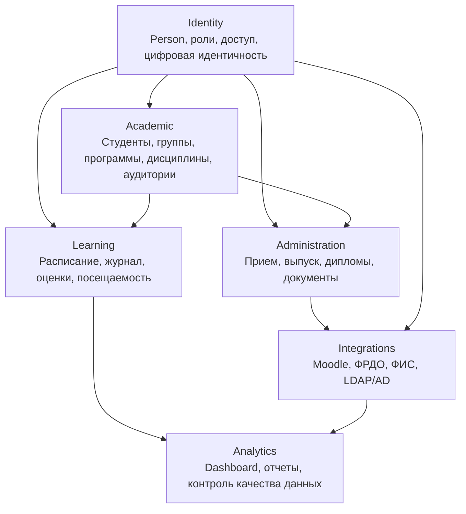

# Domain Model CollegePortal Platform

Дата: 2026-07-01

Документ описывает доменную модель CollegePortal Platform. Это архитектурное описание: backend, БД и API не изменены.

## Высокоуровневые домены

CollegePortal развивается как связанная платформа, а не набор отдельных CRUD-страниц.

Основные домены:

- `Identity`;
- `Academic`;
- `Learning`;
- `Administration`;
- `Integrations`;
- `Analytics`.

## Identity

Назначение: единая идентичность человека, роли, учетные данные, цифровые пропуска, события доступа, authentication и authorization.

Основные сущности:

- Person;
- Person Role;
- Digital Identity;
- Credential;
- QR Pass;
- Mobile Pass;
- Access Event;
- Access Device;
- User;
- Permission / Authorization context.

Связи:

- `Person` связывается со студентом, преподавателем, сотрудником, абитуриентом, гостем и выпускником;
- `Digital Identity` используется проходной, мобильным кабинетом и будущими RFID/NFC/Face ID сценариями;
- `Credential` связывает человека с входом в приложение;
- `Authorization` определяет доступ к модулям.

Состояние:

- частично реализовано: `User`, авторизация, permissions;
- планируется: `Person`, `Digital Identity`, QR-pass, Access Control.

Подробно: `docs/IDENTITY_DOMAIN.md`.

## Academic

Назначение: учебная структура колледжа.

Основные сущности:

- Student;
- Group;
- Teacher;
- Subject;
- Classroom;
- Specialty;
- Education Program;
- будущий Study Plan.

Связи:

- использует `Person` из `Identity` для студентов и преподавателей;
- дает данные для расписания, журнала и нагрузки;
- используется приемной комиссией при зачислении;
- используется ФРДО и ФИС для выгрузок.

Состояние:

- реализовано: студенты, группы, преподаватели, дисциплины, аудитории, специальности, образовательные программы;
- планируется: учебные планы, расширенные персональные данные для ФРДО.

## Learning

Назначение: ежедневный учебный процесс.

Основные сущности:

- Schedule Lesson;
- Journal Lesson;
- Grade;
- Attendance;
- Exam / GIA;
- Teacher Workload.

Связи:

- использует группы, преподавателей, дисциплины и аудитории из `Academic`;
- использует `Person` для связи посещаемости с реальным человеком;
- передает данные в `Analytics`;
- в будущем сверяется с проходной и рабочим временем.

Состояние:

- реализовано: расписание, журнал, оценки, посещаемость, базовые отчеты;
- планируется: нагрузка преподавателей, экзамены/ГИА, связь с QR-событиями.

## Administration

Назначение: административные процессы колледжа.

Основные сущности:

- Applicant Application;
- Applicant Document;
- Applicant Event;
- Admission Campaign;
- Enrollment Order;
- Alumni;
- Diploma;
- Diploma Appendix;
- Document Issue History;
- Guest Pass.

Связи:

- использует `Person` для абитуриентов, выпускников, гостей и сотрудников;
- при зачислении переводит абитуриента в студента;
- передает выпускников и дипломы в ФРДО;
- передает приемные кампании и заявления в ФИС.

Состояние:

- реализовано: приемная комиссия MVP, документы заявлений, события, зачисление;
- планируется: приемные кампании, конкурсные группы, приказы, выпускники и дипломы.

## Integrations

Назначение: обмен с внешними системами.

Основные сущности:

- Integration Endpoint;
- Integration Job;
- Exchange Log;
- Export Package;
- Import Package;
- External Dictionary Mapping;
- Error Status.

Связи:

- использует данные `Identity`, `Academic`, `Learning`, `Administration`;
- передает пользователей и группы в Moodle;
- передает выпускников и дипломы во ФРДО;
- передает приемные кампании и абитуриентов в ФИС ГИА/Приема;
- в будущем использует LDAP/AD для authentication.

Состояние:

- планируется;
- подготовлены архитектурные документы и roadmap.

## Analytics

Назначение: отчеты, Dashboard, качество данных, контроль процессов.

Основные сущности:

- Dashboard Widget;
- Report;
- Report Snapshot;
- Data Quality Check;
- Alert;
- Metric.

Связи:

- получает данные из всех доменов;
- показывает учебную, административную и интеграционную картину;
- в будущем анализирует посещаемость, опоздания, пропуски и качество данных ФРДО/ФИС.

Состояние:

- частично реализовано: Dashboard, отчеты по посещаемости и оценкам;
- планируется: role-based Dashboard, аналитика доступа, расширенная проверка данных.

## Центральная роль Person

`Person` — основа долгосрочной архитектуры. Он не заменяет сразу текущие таблицы, а становится центральной сущностью для постепенной консолидации данных.

Жизненный цикл:

- Applicant -> Student -> Alumni;
- отдельно Teacher;
- отдельно Employee;
- отдельно Guest.

Один Person может иметь несколько ролей одновременно. Например, выпускник может стать преподавателем, а преподаватель может одновременно быть сотрудником.

## Реализовано / в разработке / запланировано

Реализовано:

- Academic MVP: студенты, группы, преподаватели, дисциплины, аудитории;
- Learning MVP: расписание, журнал, оценки, посещаемость;
- Administration MVP: приемная комиссия, документы заявлений, зачисление;
- Analytics MVP: Dashboard, базовые отчеты;
- UI platform: Quasar GUI, Design System, Layout Guidelines.

В разработке / ближайший порядок:

- GUI-015: учебные планы;
- QR-001: проходная и QR-пропуска;
- MOB-001: мобильный кабинет студента;
- GRAD-001: выпускники и дипломы.

Запланировано:

- FRDO-001;
- FIS-001;
- GUI-016: нагрузка преподавателей;
- GUI-017: экзамены / ГИА;
- Moodle;
- LDAP/AD;
- RFID/NFC;
- Face ID;
- AI-анализ опозданий и отсутствий.
