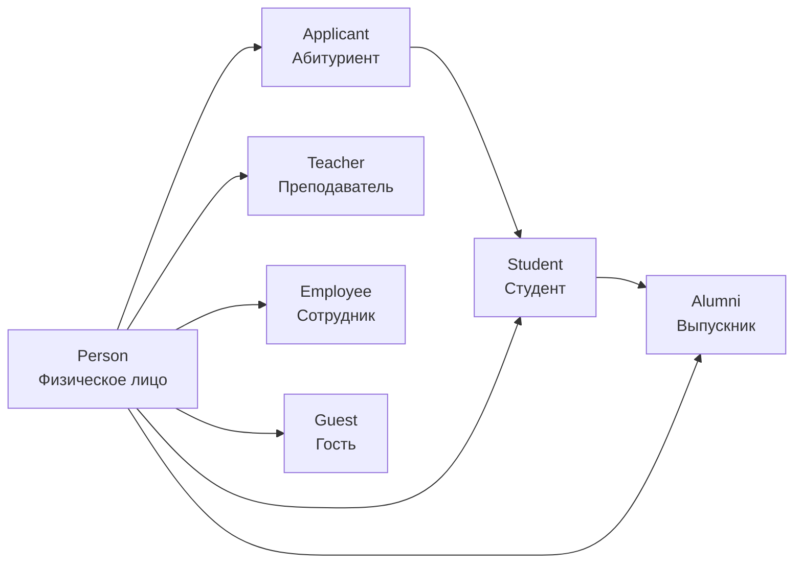
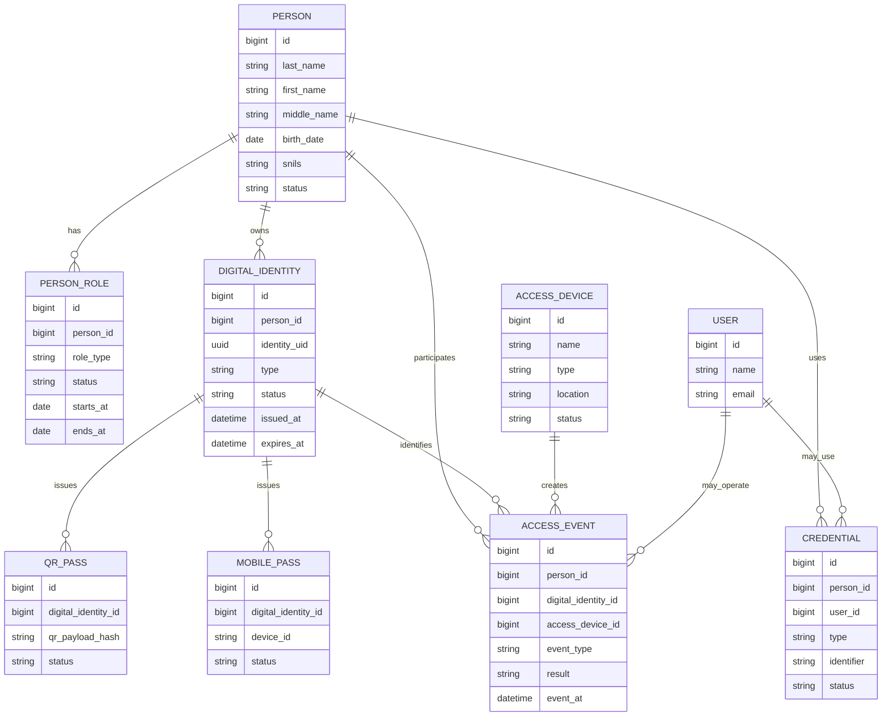

# Identity Domain Architecture

Дата: 2026-07-01

Документ описывает целевую архитектуру домена `Identity` для CollegePortal. На момент ARCH-001 это проектирование: backend, БД и API не изменены.

## Назначение домена

`Identity` отвечает за единую цифровую идентичность человека в CollegePortal. Домен должен связать физическое лицо, его роли в колледже, учетные данные, пропуска, события доступа, авторизацию, мобильный кабинет и будущие биометрические или RFID/NFC-сценарии.

Главная идея: `Person` является центральной сущностью. Студент, преподаватель, сотрудник, абитуриент, гость и выпускник — это роли одного человека, а не полностью независимые записи.

## Принципы

- Один человек хранится как одна сущность `Person`.
- Один `Person` может иметь несколько ролей одновременно.
- `Digital Identity` отделена от роли: QR, мобильный QR, RFID/NFC и будущий Face ID привязаны к человеку, а не к конкретной таблице студентов или преподавателей.
- Авторизация пользователей приложения не должна смешиваться с проходной: `Authentication` и `Access Control` связаны, но решают разные задачи.
- События доступа не редактируются задним числом, кроме служебных корректировок с аудитом.
- Будущие способы идентификации должны добавляться без перестройки доменной модели.

## Основные сущности

### Person

Назначение: единая запись о физическом лице.

Основные поля:

- `id`;
- `last_name`;
- `first_name`;
- `middle_name`;
- `birth_date`;
- `gender`;
- `snils`;
- `citizenship`;
- `phone`;
- `email`;
- `photo_path`;
- `status`: active, archived, blocked;
- `created_at`, `updated_at`.

Связи:

- имеет несколько `Role`;
- имеет одну или несколько `Digital Identity`;
- может иметь несколько `Credential`;
- участвует в `Access Event`;
- может быть связан с текущими сущностями `Student`, `Teacher`, `Applicant`, будущими `Employee`, `Guest`, `Alumni`.

Текущее состояние: планируется. Сейчас персональные данные разнесены по студентам, преподавателям, абитуриентам и пользователям.

### Digital Identity

Назначение: цифровая идентичность человека, используемая для пропусков, мобильного кабинета, QR, будущих RFID/NFC и Face ID.

Основные поля:

- `id`;
- `person_id`;
- `identity_uid`: стабильный уникальный идентификатор;
- `type`: qr, mobile_qr, printed_pass, rfid, face_template;
- `status`: active, suspended, expired, revoked;
- `issued_at`;
- `expires_at`;
- `last_used_at`;
- `metadata`.

Связи:

- принадлежит `Person`;
- используется в `QR Pass` и `Mobile Pass`;
- проверяется `Access Device`;
- порождает `Access Event`.

Текущее состояние: планируется. Концепция описана, реализация будет в QR-001.

### Role

Назначение: роль человека в колледже как в организационном, так и в учебном смысле.

Основные поля:

- `id`;
- `person_id`;
- `role_type`: student, teacher, employee, applicant, guest, alumni;
- `status`: active, inactive, archived;
- `starts_at`;
- `ends_at`;
- `source_entity_type`;
- `source_entity_id`.

Связи:

- принадлежит `Person`;
- может ссылаться на текущие таблицы студентов, преподавателей, заявлений абитуриентов;
- используется в правилах `Authorization` и `Access Control`.

Текущее состояние: частично реализовано через существующие роли пользователей и отдельные сущности студентов, преподавателей, абитуриентов. Единая модель `Person Role` планируется.

### Credential

Назначение: учетные данные для входа в систему и внешних интеграций.

Основные поля:

- `id`;
- `person_id`;
- `user_id`;
- `type`: password, ldap, oauth, api_token, one_time_code;
- `identifier`;
- `status`;
- `last_used_at`;
- `expires_at`;
- `metadata`.

Связи:

- принадлежит `Person`;
- может быть связан с текущим `User`;
- используется `Authentication`.

Текущее состояние: частично реализовано через текущую авторизацию пользователей. Связь с `Person` планируется.

### QR Pass

Назначение: печатный QR-пропуск для студенческого билета, бейджа, временного пропуска или пропуска гостя.

Основные поля:

- `id`;
- `digital_identity_id`;
- `qr_payload_hash`;
- `printed_number`;
- `issued_at`;
- `expires_at`;
- `status`;
- `print_count`.

Связи:

- основан на `Digital Identity`;
- сканируется `Access Device`;
- создает `Access Event`.

Текущее состояние: планируется для QR-001.

### Mobile Pass

Назначение: мобильный QR-пропуск в кабинете студента или сотрудника.

Основные поля:

- `id`;
- `digital_identity_id`;
- `device_id`;
- `refresh_policy`;
- `last_refreshed_at`;
- `status`;
- `metadata`.

Связи:

- основан на `Digital Identity`;
- отображается в мобильном кабинете;
- проверяется `Access Device`.

Текущее состояние: планируется для MOB-001 и QR-001.

### Access Event

Назначение: неизменяемый журнал входов, выходов и отказов доступа.

Основные поля:

- `id`;
- `person_id`;
- `digital_identity_id`;
- `access_device_id`;
- `event_type`: entry, exit, denied, manual_override;
- `event_at`;
- `direction`: in, out;
- `result`: allowed, denied, unknown, expired, blocked;
- `reason`;
- `raw_payload_hash`;
- `operator_user_id`;
- `metadata`.

Связи:

- принадлежит `Person`;
- использует `Digital Identity`;
- создается `Access Device`;
- может быть сопоставлен с расписанием, журналом и рабочим временем сотрудников.

Текущее состояние: планируется для QR-001.

### Access Device

Назначение: устройство или рабочее место, которое фиксирует проход.

Основные поля:

- `id`;
- `name`;
- `type`: usb_qr_scanner, web_terminal, turnstile, mobile_scanner, camera;
- `location`;
- `status`;
- `last_seen_at`;
- `metadata`.

Связи:

- создает `Access Event`;
- может быть закреплено за проходной или корпусом;
- в будущем может работать с Face ID, RFID/NFC и IP-камерами.

Текущее состояние: планируется для QR-001.

### Authentication

Назначение: процесс подтверждения, кто входит в приложение.

Основные элементы:

- login/password;
- session/token;
- future LDAP/AD;
- future MFA or one-time code;
- mobile cabinet authentication.

Связи:

- использует `Credential`;
- связывает текущий `User` с будущим `Person`;
- передает контекст в `Authorization`.

Текущее состояние: частично реализовано через текущую авторизацию Laravel API и frontend token flow.

### Authorization

Назначение: определяет, что пользователь может делать в системе.

Основные элементы:

- `User` permissions;
- роли приложения;
- роли `Person`;
- policies/gates;
- контекст подразделения, группы, дисциплины или процесса.

Связи:

- использует текущего `User`;
- в будущем учитывает `Person Role`;
- влияет на доступ к Dashboard, журналу, расписанию, приемной комиссии, QR-проходной и мобильному кабинету.

Текущее состояние: частично реализовано через текущие роли и permissions. Расширение через `Person` планируется.

## Жизненный цикл Person

Основной учебный сценарий:

1. `Applicant`: человек подает заявление в приемную комиссию.
2. `Student`: после зачисления получает роль студента.
3. `Alumni`: после выпуска получает роль выпускника, история обучения сохраняется.

Независимые роли:

- `Teacher`: человек может преподавать, вести дисциплины, расписание и журнал.
- `Employee`: человек может быть сотрудником, оператором проходной, администратором, работником учебной части.
- `Guest`: временная роль для посетителей, подрядчиков, родителей или участников мероприятий.

Один `Person` может одновременно быть, например, `Teacher` и `Employee`, или `Alumni` и `Teacher`. Роли имеют собственные даты начала и окончания.

## Digital Identity

`Digital Identity` должна быть стабильной оболочкой вокруг способов распознавания человека.

Поддерживаемая концепция:

- уникальный идентификатор `identity_uid`;
- QR-код для печатного пропуска;
- мобильный QR для кабинета студента;
- печатный пропуск для студенческого, бейджа или временного гостевого пропуска;
- возможность подключения Face ID в будущем;
- возможность подключения RFID/NFC в будущем без изменения архитектуры;
- отзыв, блокировка и срок действия идентичности.

Важно: QR payload не должен раскрывать лишние персональные данные. Предпочтительно хранить в QR только непрямой идентификатор или подписанный токен, а персональные данные получать через backend после проверки прав.

## Access Control

Модуль `Access Control` строится поверх `Person` и `Digital Identity`.

Сценарии:

- проходная;
- вход;
- выход;
- отказ доступа;
- ручная корректировка оператором;
- журнал событий;
- отчеты по студентам, преподавателям, сотрудникам и гостям.

Интеграции:

- расписание: сверка присутствия студента или преподавателя с занятиями;
- журнал: автоматическая подсказка отсутствий;
- рабочее время сотрудников: приход/уход, опоздания, переработки;
- Dashboard: виджеты присутствия, опозданий и текущей заполненности здания;
- уведомления: события входа/выхода, отказ доступа, просроченный пропуск.

## Mermaid-диаграмма взаимосвязей

## Текущее состояние и этапы внедрения

Сейчас реализовано:

- отдельные сущности студентов, преподавателей и абитуриентов;
- пользователи и авторизация приложения;
- роли/permissions приложения;
- приемная комиссия и зачисление абитуриента в студенты;
- концепция Person и Digital Identity в документации.

Планируется:

1. Спроектировать миграции `Person`, `Person Role`, `Digital Identity` без нарушения существующих таблиц.
2. Добавить постепенную связку текущих `Student`, `Teacher`, `Applicant` с `Person`.
3. Реализовать QR-001 как первый потребитель `Digital Identity`.
4. Подключить Mobile Student Cabinet к мобильному QR.
5. Добавить выпускников и дипломы как продолжение жизненного цикла Person.
6. Подготовить ФРДО и ФИС как внешние интеграции, использующие проверенные данные Person.

## PERSON-001: Unified Person Foundation

Добавлена базовая таблица `people` и nullable-связи с профилями студентов, преподавателей, абитуриентов, выпускников и цифровых пропусков. Digital Identity сохраняет переходную совместимость с `entity_type`/`entity_id`, но может быть связана с Person через `person_id`. Merge Person пока не реализован.
