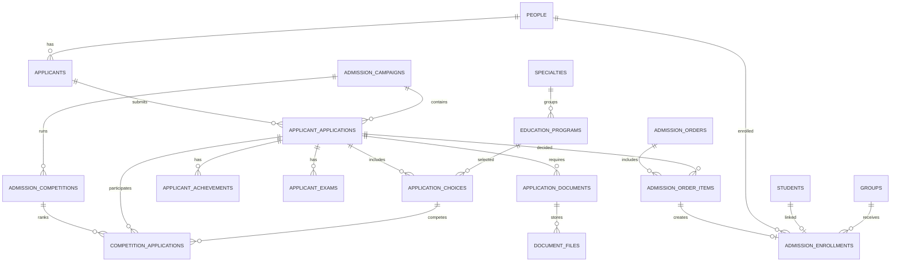

# Модель данных приемной комиссии

Документ фиксирует целевую модель данных подсистемы «Приемная комиссия» для ADM-002. Это проектный документ: миграции, Laravel-модели, API, backend, frontend и бизнес-логика в рамках ADM-002 не создаются.

Источник архитектурных решений: [Приемная комиссия](ПРИЕМНАЯ_КОМИССИЯ.md) и [ADR-002](adr/ADR-002_ПРИЕМНАЯ_КОМИССИЯ.md).

# Общая схема

Подсистема строится вокруг `Person` и заявления абитуриента. Один человек может иметь несколько профилей в CollegePortal: абитуриент, студент, сотрудник, преподаватель, выпускник и пользователь системы. Приемная комиссия не должна создавать изолированные записи людей, которые потом невозможно связать с контингентом.

Целевой поток данных:

```text
Person
  -> Applicant
      -> Application
          -> Program Choices
          -> Documents
          -> Achievements
          -> Exams
          -> Competition
          -> Order
          -> Enrollment -> Student
          -> FIS package snapshot
```

Ключевые правила:

- персональные данные хранятся в общей модели `Person`, профиль абитуриента содержит только приемные атрибуты;
- заявление отделено от выбранных специальностей, документов, достижений, экзаменов, конкурса и приказов;
- статусы и типы хранятся через Reference Data, а не строковыми константами в коде;
- комплектность документов и административное подтверждение получения документов остаются разными показателями;
- зачисление является отдельной идемпотентной операцией, а не только сменой статуса заявления;
- интеграция ФИС использует отдельные пакеты и снимки данных, не управляя внутренней моделью заявления напрямую.

# Сущности

## Персона

Целевая таблица: `people`.

### Назначение

Единая карточка физического лица. Используется для связи абитуриента с будущим студентом, выпускником, пользователем и цифровой идентичностью.

### Основные поля

| Поле | Назначение |
| --- | --- |
| `id` | первичный ключ |
| `last_name` | фамилия |
| `first_name` | имя |
| `middle_name` | отчество |
| `birth_date` | дата рождения |
| `gender_id` | ссылка на справочник пола |
| `citizenship_id` | ссылка на справочник гражданства |
| `phone` | контактный телефон, nullable |
| `email` | контактный email, nullable |
| `photo_path` | путь к общей фотографии |
| `snils_hash` | хеш СНИЛС для поиска дублей без вывода полного значения |
| `inn_hash` | хеш ИНН при необходимости |
| `status_id` | статус записи Person |
| `created_at`, `updated_at` | технические даты |

### Обязательные поля

- `last_name`;
- `first_name`;
- `status_id`.

`birth_date` рекомендуется сделать обязательной для новых абитуриентов, если это соответствует правилам приемной кампании. На переходном этапе поле может быть nullable для совместимости с историческими данными.

### Связи

- `people` 1:N `applicants`;
- `people` 1:N `students`;
- `people` 1:N `users`;
- `people` 1:N `digital_identities`.

### Ограничения

- автоматическое объединение только по ФИО запрещено;
- поиск возможных дублей выполняется по СНИЛС, email, телефону, документу или ФИО + дата рождения;
- полные значения СНИЛС, паспортов и других чувствительных идентификаторов не выводятся в audit payload.

### Индексы

- `status_id`;
- `last_name`, `first_name`, `middle_name`;
- `birth_date`;
- `email`;
- `phone`;
- `snils_hash`, если поле заполнено.

### Архивирование

Person не удаляется физически при наличии связанных профилей. Для закрытия записи используется статус или `archived_at` на уровне профиля.

### Аудит

Аудируются создание, изменение ФИО, контактов, фото, статуса и ручная привязка профилей. Чувствительные значения маскируются.

## Абитуриент

Целевая таблица: `applicants`.

### Назначение

Профиль человека в приемной кампании. Он отделяет общую Person-карточку от приемных атрибутов: источника обращения, ответственного сотрудника и состояния работы приемной комиссии.

### Основные поля

| Поле | Назначение |
| --- | --- |
| `id` | первичный ключ |
| `person_id` | ссылка на Person |
| `source_id` | источник обращения или импорта |
| `status_id` | статус профиля абитуриента |
| `first_contact_at` | дата первого обращения |
| `responsible_user_id` | ответственный сотрудник |
| `notes` | внутренний комментарий |
| `archived_at` | дата архивирования |
| `created_at`, `updated_at` | технические даты |

### Обязательные поля

- `person_id`;
- `status_id`.

### Связи

- `applicants` N:1 `people`;
- `applicants` 1:N `applicant_applications`.

### Ограничения

- один Person может иметь несколько заявлений через один или несколько applicant-профилей, если разные приемные кампании требуют раздельного учета;
- неоднозначные дубли не объединяются автоматически.

### Индексы

- `person_id`;
- `status_id`;
- `source_id`;
- `responsible_user_id`;
- `archived_at`.

### Архивирование

Профиль абитуриента архивируется после завершения приемной кампании или при ошибочной регистрации. Связанные заявления не удаляются.

### Аудит

Аудируются создание профиля, смена ответственного, архивирование и ручное связывание с Person.

## Заявление

Целевая таблица: `applicant_applications`.

### Назначение

Центральная сущность приемной комиссии. Фиксирует юридически значимое намерение поступить, статус обработки, приемную кампанию и источник данных.

### Основные поля

| Поле | Назначение |
| --- | --- |
| `id` | первичный ключ |
| `applicant_id` | ссылка на профиль абитуриента |
| `campaign_id` | приемная кампания |
| `application_number` | внутренний номер заявления |
| `external_source_id` | источник внешней системы |
| `external_application_id` | номер или идентификатор во внешней системе |
| `status_id` | статус заявления |
| `submitted_at` | дата подачи |
| `base_education_type_id` | база поступления |
| `education_form_id` | форма обучения |
| `funding_form_id` | форма финансирования |
| `documents_provided` | административный признак подтверждения получения документов |
| `ready_for_enrollment` | операционный признак готовности к зачислению |
| `recommended_at` | дата рекомендации |
| `responsible_user_id` | ответственный сотрудник |
| `comment` | внутренний комментарий |
| `archived_at` | дата архивирования |
| `created_at`, `updated_at` | технические даты |

### Обязательные поля

- `applicant_id`;
- `campaign_id`;
- `application_number`;
- `status_id`;
- `submitted_at`.

### Связи

- `applicant_applications` N:1 `applicants`;
- `applicant_applications` N:1 `admission_campaigns`;
- `applicant_applications` 1:N `applicant_application_choices`;
- `applicant_applications` 1:N `applicant_application_documents`;
- `applicant_applications` 1:N `applicant_achievements`;
- `applicant_applications` 1:N `applicant_exams`;
- `applicant_applications` 1:N `admission_competition_applications`;
- `applicant_applications` 1:N `admission_order_items`;
- `applicant_applications` 0:1 `admission_enrollments`.

### Ограничения

- `application_number` уникален внутри приемной кампании;
- `external_source_id` + `external_application_id` уникальны при наличии внешнего источника;
- `documents_provided` не равен полному комплекту документов;
- `ready_for_enrollment` не должен автоматически выставляться только из-за `documents_provided`.

### Индексы

- `campaign_id`, `application_number`;
- `status_id`;
- `submitted_at`;
- `applicant_id`;
- `responsible_user_id`;
- `external_source_id`, `external_application_id`;
- `documents_provided`;
- `ready_for_enrollment`;
- `archived_at`.

### Архивирование

Физическое удаление заявления запрещено после появления документов, конкурсных записей, приказов, событий или ФИС-пакетов. Используется `archived_at` и финальный статус.

### Аудит

Аудируются создание, смена статуса, изменение ответственного, изменение ключевых признаков, архивирование, включение в конкурс и подготовка к зачислению.

## Выбранная специальность

Целевая таблица: `applicant_application_choices`.

### Назначение

Фиксирует одну выбранную специальность или образовательную программу внутри заявления. Позволяет поддержать несколько приоритетов без дублирования заявления.

### Основные поля

| Поле | Назначение |
| --- | --- |
| `id` | первичный ключ |
| `application_id` | заявление |
| `specialty_id` | специальность |
| `education_program_id` | образовательная программа |
| `priority` | приоритет выбора |
| `education_form_id` | форма обучения |
| `funding_form_id` | форма финансирования |
| `quota_type_id` | квота или основание конкурса |
| `status_id` | статус выбора |
| `is_primary` | основной выбор для отображения |
| `created_at`, `updated_at` | технические даты |

### Обязательные поля

- `application_id`;
- `education_program_id`;
- `priority`;
- `status_id`.

### Связи

- `applicant_application_choices` N:1 `applicant_applications`;
- `applicant_application_choices` N:1 `specialties`;
- `applicant_application_choices` N:1 `education_programs`.

### Ограничения

- `application_id` + `priority` уникальны;
- одна образовательная программа не должна повторяться в одном заявлении без отдельного основания;
- `is_primary` может быть true только у одного выбора заявления.

### Индексы

- `application_id`;
- `education_program_id`;
- `specialty_id`;
- `priority`;
- `status_id`;
- `education_form_id`, `funding_form_id`, `quota_type_id`.

### Архивирование

Выбор архивируется через статус, если заявление изменено или направление исключено из конкурса. История сохраняется.

### Аудит

Аудируются добавление, удаление, смена приоритета, программы, формы обучения, финансирования и конкурсного статуса.

## Документ

Целевые таблицы: `applicant_application_documents`, `applicant_document_files`.

### Назначение

Фиксирует тип документа, состояние приема и проверки, а также вложенные файлы в private storage.

### Основные поля `applicant_application_documents`

| Поле | Назначение |
| --- | --- |
| `id` | первичный ключ |
| `application_id` | заявление |
| `document_type_id` | тип документа |
| `status_id` | статус документа |
| `received_at` | дата получения |
| `verified_at` | дата проверки |
| `verified_by` | проверивший пользователь |
| `number` | номер документа, если разрешено хранить |
| `issued_at` | дата выдачи |
| `expires_at` | срок действия |
| `comment` | комментарий проверки |
| `created_at`, `updated_at` | технические даты |

### Основные поля `applicant_document_files`

| Поле | Назначение |
| --- | --- |
| `id` | первичный ключ |
| `document_id` | документ заявления |
| `original_name` | исходное имя файла |
| `path` | путь private storage |
| `mime_type` | MIME-тип |
| `size_bytes` | размер |
| `sha256` | контрольная сумма |
| `uploaded_by` | загрузивший пользователь |
| `created_at` | дата загрузки |

### Обязательные поля

- `application_id`;
- `document_type_id`;
- `status_id`.

Для файла обязательны `document_id`, `path`, `mime_type`, `size_bytes`, `sha256`.

### Связи

- `applicant_application_documents` N:1 `applicant_applications`;
- `applicant_application_documents` N:1 `applicant_document_types`;
- `applicant_document_files` N:1 `applicant_application_documents`.

### Ограничения

- один обязательный тип документа не должен бесконтрольно дублироваться в одном заявлении;
- файлы хранятся только в private storage;
- содержимое файлов и чувствительные реквизиты не пишутся в audit payload.

### Индексы

- `application_id`, `document_type_id`;
- `status_id`;
- `received_at`;
- `verified_by`;
- `sha256` для файлов.

### Архивирование

Документы не удаляются физически после участия заявления в конкурсе или приказе. Ошибочный документ помечается статусом, файл может быть помечен как замененный.

### Аудит

Аудируются прием, проверка, отклонение, замена файла, удаление файла до фиксации и изменение статуса. Не аудируется содержимое файла.

### Реализация BACK-005

BACK-005 не использует legacy-таблицы `applicant_application_documents` и `applicant_document_files`. Для Admissions Foundation добавлены отдельные структуры:

| Таблица | Назначение |
| --- | --- |
| `admission_identity_documents` | структурированные документы, удостоверяющие личность, связанные с `Applicant` и `Person` |
| `admission_education_documents` | структурированные документы об образовании, связанные с `Applicant` |
| `admission_document_files` | private-файлы документов личности и образования с optional-связью на foundation-заявление |

Дополнительно в `people` добавлено поле `snils_hash` для поиска дублей СНИЛС без раскрытия значения. Сам СНИЛС остается атрибутом `Person`, потому что принадлежит человеку, а не отдельному заявлению.

Новые справочники:

- `admission_identity_document_types`;
- `admission_education_document_types`;
- `admission_document_verification_statuses`;
- `admission_document_file_categories`;
- `education_levels`.

Основные ограничения BACK-005:

- серия, номер и СНИЛС маскируются в API без sensitive permission;
- `number_hash` используется для технического поиска и не выводится в API;
- private storage path не выводится в API и не пишется в audit payload;
- удаление документа и файла является архивированием;
- готовность заявления рассчитывается отдельно как `internal_complete`, `review_complete` и `fis_data_ready`;
- ФИС XML, XSD validation пакета, SOAP и отправка остаются за пределами BACK-005.

### Укрепление BACK-005.1

BACK-005.1 добавляет к foundation-документам:

| Таблица/поле | Назначение |
| --- | --- |
| `admission_application_documents` | явная связь одного foundation-заявления с конкретной версией документа личности и документа об образовании |
| `previous_version_id` | ссылка на предыдущую версию документа |
| `version_number` | порядковый номер версии документа |
| `replaced_by_document_id` | ссылка на новую версию, заменившую текущую |
| `replaced_at` | момент замены версии |
| `qualification_name` | квалификация по документу об образовании, подтвержденная XSD |
| `speciality_name` | специальность или профессия по документу об образовании, подтвержденная XSD |
| `registration_number` | регистрационный номер документа об образовании |
| `is_nostrificated` | признак признания иностранного документа, подтвержденный XSD |

Правило воспроизводимости: после регистрации заявление не ищет «последний активный» документ Applicant, а использует закрепленную запись из `admission_application_documents`. Изменение реквизитов закрепленного документа создает новую версию, старая версия остается связанной с зарегистрированным заявлением.

Словари ФИС не хранятся как внутренние ID в доменных таблицах. Для readiness используется существующая таблица `fis_external_mappings`, где `ReferenceItem` сопоставляется с конкретным словарем ФИС и environment.

## Индивидуальные достижения

Целевая таблица: `applicant_achievements`.

### Назначение

Учитывает достижения абитуриента, которые могут давать конкурсные баллы.

### Основные поля

| Поле | Назначение |
| --- | --- |
| `id` | первичный ключ |
| `application_id` | заявление |
| `achievement_type_id` | тип достижения |
| `title` | название |
| `points` | начисленные баллы |
| `document_id` | подтверждающий документ |
| `status_id` | статус проверки |
| `verified_by` | проверивший пользователь |
| `verified_at` | дата проверки |
| `comment` | комментарий |
| `created_at`, `updated_at` | технические даты |

### Обязательные поля

- `application_id`;
- `achievement_type_id`;
- `status_id`.

### Связи

- `applicant_achievements` N:1 `applicant_applications`;
- `applicant_achievements` N:1 `applicant_achievement_types`;
- `applicant_achievements` N:0..1 `applicant_application_documents`.

### Ограничения

- баллы должны укладываться в правила приемной кампании;
- общий максимум баллов по достижениям считается по конкурсным правилам, а не хранится только в заявлении.

### Индексы

- `application_id`;
- `achievement_type_id`;
- `status_id`;
- `verified_by`.

### Архивирование

Достижение архивируется через статус, если оно отклонено или заменено. История начисления сохраняется.

### Аудит

Аудируются добавление, проверка, изменение баллов, отклонение и привязка документа.

## Экзамен

Целевая таблица: `applicant_exams`.

### Назначение

Фиксирует вступительные испытания, ГИА или иные экзамены, влияющие на конкурс.

### Основные поля

| Поле | Назначение |
| --- | --- |
| `id` | первичный ключ |
| `application_id` | заявление |
| `exam_type_id` | тип экзамена |
| `subject_id` | дисциплина или предмет |
| `scheduled_at` | дата и время |
| `score` | результат |
| `max_score` | максимальный балл |
| `status_id` | статус экзамена |
| `commission_id` | комиссия |
| `protocol_number` | номер протокола |
| `comment` | комментарий |
| `created_at`, `updated_at` | технические даты |

### Обязательные поля

- `application_id`;
- `exam_type_id`;
- `status_id`.

### Связи

- `applicant_exams` N:1 `applicant_applications`;
- `applicant_exams` N:1 `subjects`, если экзамен связан с предметом;
- `applicant_exams` N:0..1 `exam_commissions`.

### Ограничения

- `score` не может быть меньше 0 или больше `max_score`;
- повторная сдача должна фиксироваться отдельной записью или версией результата по правилам кампании;
- экзамены не должны смешиваться с журналом студентов.

### Индексы

- `application_id`;
- `exam_type_id`;
- `subject_id`;
- `status_id`;
- `scheduled_at`.

### Архивирование

Экзамен не удаляется после публикации конкурсных результатов. Ошибки исправляются через статус, новую запись или audit-событие.

### Аудит

Аудируются назначение, перенос, ввод результата, изменение результата и отмена.

## Конкурс

Целевые таблицы: `admission_competitions`, `admission_competition_applications`.

### Назначение

Группирует заявления по конкурсному направлению и правилам ранжирования. Отделяет конкурсный расчет от карточки заявления.

### Основные поля `admission_competitions`

| Поле | Назначение |
| --- | --- |
| `id` | первичный ключ |
| `campaign_id` | приемная кампания |
| `specialty_id` | специальность |
| `education_program_id` | образовательная программа |
| `education_form_id` | форма обучения |
| `funding_form_id` | форма финансирования |
| `quota_type_id` | квота |
| `places_total` | количество мест |
| `ranking_rule_id` | правило ранжирования |
| `status_id` | статус конкурса |
| `created_at`, `updated_at` | технические даты |

### Основные поля `admission_competition_applications`

| Поле | Назначение |
| --- | --- |
| `id` | первичный ключ |
| `competition_id` | конкурс |
| `application_id` | заявление |
| `choice_id` | выбранная специальность |
| `score_total` | итоговый балл |
| `rank_position` | позиция в рейтинге |
| `status_id` | конкурсный статус |
| `recommended_at` | дата рекомендации |
| `created_at`, `updated_at` | технические даты |

### Обязательные поля

Для конкурса:

- `campaign_id`;
- `education_program_id`;
- `education_form_id`;
- `funding_form_id`;
- `places_total`;
- `status_id`.

Для участника конкурса:

- `competition_id`;
- `application_id`;
- `choice_id`;
- `status_id`.

### Связи

- `admission_competitions` N:1 `admission_campaigns`;
- `admission_competitions` N:1 `education_programs`;
- `admission_competitions` 1:N `admission_competition_applications`;
- `admission_competition_applications` N:1 `applicant_applications`.

### Ограничения

- конкурс уникален по кампании, программе, форме обучения, форме финансирования и квоте;
- заявление не должно участвовать в одном конкурсе дважды;
- `rank_position` пересчитывается конкурсным сервисом, а не редактируется вручную без audit.

### Индексы

- `campaign_id`, `education_program_id`, `education_form_id`, `funding_form_id`, `quota_type_id`;
- `status_id`;
- `competition_id`, `rank_position`;
- `application_id`;
- `choice_id`.

### Архивирование

Конкурс закрывается статусом после завершения кампании. Участники и результаты сохраняются для приказов, отчетов и ФИС.

### Аудит

Аудируются создание конкурса, изменение мест, изменение правил, пересчет рейтинга, рекомендация и снятие рекомендации.

## Приказ

Целевые таблицы: `admission_orders`, `admission_order_items`.

### Назначение

Фиксирует административное решение приемной комиссии: зачисление, отказ, отмену или иное действие.

### Основные поля `admission_orders`

| Поле | Назначение |
| --- | --- |
| `id` | первичный ключ |
| `campaign_id` | приемная кампания |
| `order_number` | номер приказа |
| `order_date` | дата приказа |
| `order_type_id` | тип приказа |
| `status_id` | статус приказа |
| `signed_by` | подписант |
| `approved_by` | утвердивший пользователь |
| `approved_at` | дата утверждения |
| `file_id` | файл печатной формы |
| `comment` | комментарий |
| `created_at`, `updated_at` | технические даты |

### Основные поля `admission_order_items`

| Поле | Назначение |
| --- | --- |
| `id` | первичный ключ |
| `order_id` | приказ |
| `application_id` | заявление |
| `competition_application_id` | конкурсная запись |
| `action_id` | действие приказа |
| `target_group_id` | группа для зачисления |
| `status_id` | статус строки приказа |
| `created_at`, `updated_at` | технические даты |

### Обязательные поля

Для приказа:

- `campaign_id`;
- `order_number`;
- `order_date`;
- `order_type_id`;
- `status_id`.

Для строки приказа:

- `order_id`;
- `application_id`;
- `action_id`;
- `status_id`.

### Связи

- `admission_orders` N:1 `admission_campaigns`;
- `admission_orders` 1:N `admission_order_items`;
- `admission_order_items` N:1 `applicant_applications`;
- `admission_order_items` N:0..1 `admission_competition_applications`.

### Ограничения

- `order_number` уникален внутри приемной кампании и типа приказа;
- утвержденный приказ нельзя редактировать обычным CRUD-действием;
- отмена приказа оформляется отдельным статусом или отдельным приказом по правилам колледжа.

### Индексы

- `campaign_id`, `order_number`;
- `order_type_id`;
- `status_id`;
- `approved_at`;
- `order_id`, `application_id`.

### Архивирование

Приказы не удаляются физически. Ошибочные приказы получают статус отмены или заменяются новым приказом.

### Аудит

Аудируются создание, изменение проекта, утверждение, отмена, добавление и удаление строк до утверждения.

## Зачисление

Целевая таблица: `admission_enrollments`.

### Назначение

Фиксирует результат перевода абитуриента в контингент студентов. Связывает заявление, Person, приказ, группу и созданную или найденную запись студента.

### Основные поля

| Поле | Назначение |
| --- | --- |
| `id` | первичный ключ |
| `application_id` | заявление |
| `person_id` | Person |
| `order_item_id` | строка приказа |
| `student_id` | созданный или связанный студент |
| `group_id` | учебная группа |
| `education_program_id` | образовательная программа |
| `enrolled_at` | дата зачисления |
| `status_id` | статус зачисления |
| `created_by` | пользователь, выполнивший зачисление |
| `created_at`, `updated_at` | технические даты |

### Обязательные поля

- `application_id`;
- `person_id`;
- `order_item_id`;
- `status_id`.

`student_id` становится обязательным после успешного применения зачисления.

### Связи

- `admission_enrollments` 1:1 `applicant_applications`;
- `admission_enrollments` N:1 `people`;
- `admission_enrollments` N:1 `admission_order_items`;
- `admission_enrollments` N:0..1 `students`;
- `admission_enrollments` N:0..1 `groups`.

### Ограничения

- активное зачисление по одному заявлению должно быть уникальным;
- повторное применение операции не создает второго студента;
- если Person уже связан со студентом, операция должна использовать существующую связь или остановиться на ручной проверке.

### Индексы

- `application_id`;
- `person_id`;
- `order_item_id`;
- `student_id`;
- `group_id`;
- `status_id`;
- `enrolled_at`.

### Архивирование

Зачисление не удаляется физически. Ошибка исправляется отменой, новым статусом или отдельным audit-событием.

### Аудит

Аудируются preview, применение, обнаружение дубля, создание студента, связь с существующим студентом и отмена.

## Статусы

Целевые таблицы: Reference Data или специализированные справочники статусов.

### Назначение

Статусы описывают жизненные циклы заявлений, документов, конкурсов, приказов и зачислений. Они не должны быть зашиты строками во frontend или backend.

### Основные поля

| Поле | Назначение |
| --- | --- |
| `id` | первичный ключ |
| `code` | стабильный машинный код |
| `name` | русское название |
| `module` | модуль |
| `entity_type` | тип сущности |
| `sort_order` | порядок отображения |
| `is_final` | финальный статус |
| `system` | системная запись |
| `active` | доступность |
| `metadata` | JSON для расширения |
| `created_at`, `updated_at` | технические даты |

### Обязательные поля

- `code`;
- `name`;
- `module`;
- `entity_type`;
- `active`.

### Связи

Используются как внешние ключи во всех доменных сущностях приемной комиссии.

### Ограничения

- `module` + `entity_type` + `code` уникальны;
- системные статусы нельзя удалять;
- изменение кода системного статуса запрещено после появления данных.

### Индексы

- `module`, `entity_type`, `code`;
- `active`;
- `sort_order`.

### Архивирование

Статусы деактивируются через `active = false`. Физическое удаление системных статусов запрещено.

### Аудит

Аудируются создание, изменение названия, порядка, активности и metadata.

## Справочники

Целевые таблицы: `reference_items` или специализированные справочники, если домен требует отдельной структуры.

### Назначение

Хранят типы документов, формы обучения, формы финансирования, основания поступления, виды квот, типы достижений, типы экзаменов, правила рейтинга и коды ФИС.

### Основные поля

| Поле | Назначение |
| --- | --- |
| `id` | первичный ключ |
| `dictionary` | имя справочника |
| `code` | внутренний код |
| `name` | русское название |
| `external_code` | код внешней системы |
| `active` | доступность |
| `system` | системная запись |
| `sort_order` | порядок отображения |
| `metadata` | JSON для дополнительных правил |
| `created_at`, `updated_at` | технические даты |

### Обязательные поля

- `dictionary`;
- `code`;
- `name`;
- `active`.

### Связи

Справочники используются всеми сущностями приемной комиссии и интеграционным слоем ФИС.

### Ограничения

- `dictionary` + `code` уникальны;
- `external_code` может быть не уникален глобально, но должен быть контролируем внутри конкретного справочника и внешней системы;
- системные записи нельзя физически удалять.

### Индексы

- `dictionary`, `code`;
- `dictionary`, `external_code`;
- `active`;
- `sort_order`.

### Архивирование

Справочные значения деактивируются. Исторические записи продолжают ссылаться на старое значение.

### Аудит

Аудируются изменения кодов, названий, активности, внешних кодов и metadata.

# Связи

Основные связи модели:

- `Person` 1:N `Applicant`;
- `Applicant` 1:N `Application`;
- `Application` 1:N `Program Choice`;
- `Application` 1:N `Document`;
- `Document` 1:N `Document File`;
- `Application` 1:N `Achievement`;
- `Application` 1:N `Exam`;
- `Competition` 1:N `Competition Application`;
- `Application` 1:N `Competition Application`;
- `Order` 1:N `Order Item`;
- `Application` 1:N `Order Item`;
- `Order Item` 0..1:1 `Enrollment`;
- `Enrollment` N:1 `Person`;
- `Enrollment` 0..1:1 `Student`;
- Reference Data N:1 используется всеми статусными и типовыми полями.

Практическое правило: заявление остается источником операционной работы приемной комиссии, но приказ и зачисление являются отдельными юридически значимыми сущностями. Конкурсная строка хранит расчетный результат, а не заменяет заявление.

# Справочники

Минимальный набор справочников ADM-002:

| Справочник | Примеры значений | Используется |
| --- | --- | --- |
| `admission_application_statuses` | новое, на проверке, готово к конкурсу, рекомендовано, зачислено, отказано | заявление |
| `applicant_statuses` | активный, архивный, дубль, ошибочный | абитуриент |
| `application_choice_statuses` | активный, исключен, рекомендован, отклонен | выбранная специальность |
| `applicant_document_types` | паспорт, аттестат, СНИЛС, фото, согласие | документы |
| `applicant_document_statuses` | ожидается, получен, проверен, отклонен, заменен | документы |
| `achievement_types` | олимпиада, ГТО, волонтерство, профильное достижение | достижения |
| `exam_types` | вступительное испытание, ГИА, собеседование | экзамены |
| `competition_statuses` | проект, открыт, расчет, опубликован, закрыт | конкурс |
| `order_types` | зачисление, отказ, отмена, изменение | приказ |
| `order_statuses` | проект, на согласовании, утвержден, отменен | приказ |
| `enrollment_statuses` | подготовлено, применено, отменено, ошибка | зачисление |
| `education_forms` | очная, очно-заочная, заочная | заявление, конкурс |
| `funding_forms` | бюджет, договор | заявление, конкурс |
| `base_education_types` | 9 классов, 11 классов, СПО | заявление |
| `quota_types` | общий конкурс, целевая квота, льгота | выбор, конкурс |
| `admission_sources` | ручной ввод, ФИС импорт, портал абитуриента | абитуриент, заявление |
| `fis_dictionary_mappings` | коды ФИС | интеграция |

Требования к справочникам:

- значения должны иметь стабильный `code`;
- русское название может меняться без изменения кода;
- внешние коды ФИС хранятся отдельно от внутреннего кода;
- системные значения нельзя удалять после запуска миграций;
- выключение значения делается через `active = false`.

# Жизненный цикл данных

## Регистрация

1. Сотрудник создает или находит `Person`.
2. Создается профиль `Applicant`.
3. Создается `Application` в рамках приемной кампании.
4. Добавляются выбранные специальности и программы.

## Прием документов

1. Для заявления создаются ожидаемые документы по правилам кампании.
2. Сотрудник фиксирует получение документа.
3. Файлы загружаются в private storage.
4. Проверка документа меняет статус документа, но не подменяет комплектность заявления.

## Проверка и конкурс

1. Комплектность считается по обязательным типам документов.
2. Достижения и экзамены добавляют конкурсные показатели.
3. Конкурсная запись связывает заявление с конкурсом и выбранной программой.
4. Рейтинг и рекомендация фиксируются в конкурсных таблицах.

## Приказ и зачисление

1. Рекомендованные заявления попадают в проект приказа.
2. После утверждения приказа создается или применяется `Enrollment`.
3. Зачисление связывает `Person` со студентом и группой.
4. Повторный запуск зачисления должен быть идемпотентным.

## Архив

1. Завершенные кампании закрываются.
2. Заявления, конкурсы, приказы и зачисления не удаляются физически.
3. Ошибочные записи получают статусы отмены, отклонения или архива.
4. ФИС-пакеты сохраняют снимки данных для трассировки обмена.

# ER-диаграмма



# Ограничения

- ADM-002 не создает миграции, таблицы, Laravel-модели, API или frontend.
- Модель должна развиваться эволюционно и не ломать существующий раздел `/admissions`.
- Полные персональные данные, документы, raw payload ФИС и секреты не должны попадать в audit payload, logs или публичные отчеты.
- Статусы и типы не зашиваются строковыми константами в интерфейс.
- Комплектность документов считается по документам, а не по одному флагу `documents_provided`.
- Зачисление не должно создавать дублей студентов.
- ФИС production-контур не используется без отдельного stop-gate и отдельной задачи.
- Исторические данные не удаляются физически после участия в конкурсе, приказе, зачислении или ФИС-пакете.

# Подготовка к миграциям

ADM-003 или следующий implementation-этап должен начинаться с отдельного плана миграций. Рекомендуемая последовательность:

1. Справочники и статусы:
   - создать или расширить Reference Data;
   - загрузить системные значения;
   - добавить внешние коды ФИС отдельными полями.
2. Person и Applicant:
   - убедиться, что `people` готова к связям;
   - добавить applicant-профиль без разрушения текущих заявлений.
3. Заявления:
   - спроектировать nullable-поля для переходного периода;
   - сохранить совместимость с текущими импортами и UI.
4. Выбранные специальности:
   - вынести приоритеты и программы в отдельную таблицу;
   - миграцию текущего единственного выбора делать через backfill.
5. Документы:
   - отделить registry документов от файлов;
   - сохранить текущую логику комплектности и административного подтверждения.
6. Достижения и экзамены:
   - добавить как самостоятельные дочерние сущности заявления.
7. Конкурсы:
   - создать конкурсы и конкурсные строки без изменения статуса заявления задним числом.
8. Приказы и зачисления:
   - добавить идемпотентную модель приказа и Enrollment;
   - связать Enrollment со студентом только через проверенный apply.
9. Индексы и ограничения:
   - включать уникальность после dry-run проверки текущих данных;
   - добавить частичные уникальные индексы там, где nullable-поля участвуют в уникальности.
10. Audit:
   - добавить audit-события для всех изменений;
   - исключить чувствительные payload.

Перед применением миграций нужно подготовить dry-run отчет:

- количество текущих заявлений;
- количество заявлений без Person;
- возможные дубли Person;
- документы без типа;
- заявления без программы;
- конфликтующие номера заявлений;
- записи, которые нельзя автоматически перенести.
